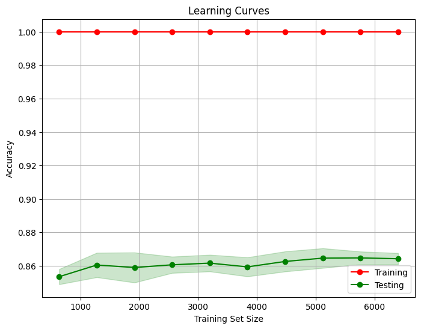
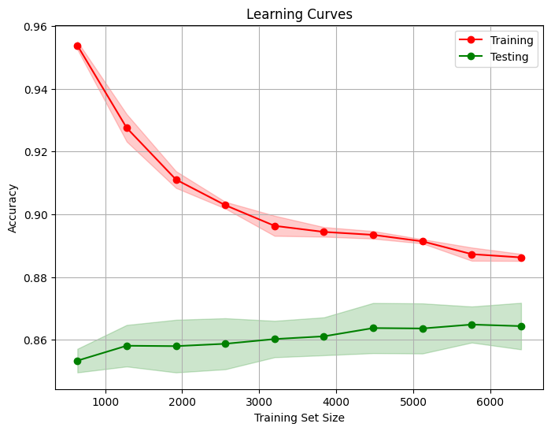

# Bank Churn Prediction Analysis Project

1. [Introduction](#introduction)
2. [Dataset](#dataset)
3. [Analysis](#analysis)
4. [Model Comparison And Evaluation](#model-comparison-and-evaluation)
5. [Learning Curve Analysis](#learning-curve-analysis)
6. [Conclusion](#conclusion)
7. [Usage](#usage)

## Introduction

This project aims to predict customer churn in a bank using a dataset of bank churners. The dataset was analyzed using various machine learning algorithms, including logistic regression and random forest. The results of the analysis and model evaluation are presented in this readme file.

## Dataset

The dataset used for this project contains information about bank customers and their churn status. The data was preprocessed by cleaning the dataset, which involved renaming columns and converting categorical variables into dummy variables.

## Analysis

1. [Logistic Regression](#logistic-regression)
2. [Random Forest](#random-forest)

### Logistic Regression

The first algorithm used for prediction was logistic regression. After fitting the logistic regression model, a classification report and confusion matrix were generated. The results are as follows:

**Confusion matrix — Normalized logistic reg**
```
[[1532   65]
 [ 319   84]]
```

**Classification report — Normalized logistic reg**
```
              precision    recall  f1-score   support

           0       0.83      0.96      0.89      1597
           1       0.56      0.21      0.30       403

    accuracy                           0.81      2000
   macro avg       0.70      0.58      0.60      2000
weighted avg       0.77      0.81      0.77      2000
```

### Random Forest

Due to the presence of outliers in the data, logistic regression did not yield satisfactory results. To overcome this issue, a random forest algorithm was employed, as it is known to be resilient to outliers and unevenly distributed data.

The random forest algorithm was run twice, first without cross-validation and randomized search, and then with cross-validation and randomized search.

**Random Forest without CV and Randomized Search**

The random forest model was trained on the training data, and predictions were made on the test data. The results of the confusion matrix and classification report are as follows:

**Confusion matrix — Random forest (without CV and Randomized Search)**
```
[[1533   64]
 [ 225  178]]
```

**Classification report — Random forest (without CV and Randomized Search)**
```
              precision    recall  f1-score   support

           0       0.87      0.96      0.91      1597
           1       0.74      0.44      0.55       403

    accuracy                           0.86      2000
   macro avg       0.80      0.70      0.73      2000
weighted avg       0.84      0.86      0.84      2000
```

**Random Forest with CV and Randomized Search**

The random forest model was also trained using cross-validation and randomized search to optimize the hyperparameters. The results of the confusion matrix and classification report are as follows:

**Confusion Matrix — Random forest with CV and Randomized Search**
```
[[1556   41]
 [ 248  155]]
```

**Classification Report — Random forest with CV and Randomized Search**
```
              precision    recall  f1-score   support

           0       0.86      0.97      0.92      1597
           1       0.79      0.38      0.52       403

    accuracy                           0.86      2000
   macro avg       0.83      0.68      0.72      2000
weighted avg       0.85      0.86     

 0.83      2000
```

## Model Comparison and Evaluation

Based on the evaluation metrics, the performance of the models can be compared. The logistic regression model achieved an accuracy of 0.81, with a macro-average F1-score of 0.60. However, the random forest models outperformed logistic regression in terms of accuracy, F1-score, and recall.

The random forest model without cross-validation and randomized search had an accuracy of 0.86, with a macro-average F1-score of 0.73. This model seemed to overfit the data, as indicated by the fixed 100% training set accuracy curve in the learning curve plot.

The random forest model with cross-validation and randomized search achieved similar accuracy but had a better balance between training and testing performance, as indicated by the learning curve. It had an accuracy of 0.86, with a macro-average F1-score of 0.72.

## Learning Curve Analysis

To gain further insights into the performance and behavior of the models, learning curves were plotted. For the first random forest model, the learning curve for the training set (red curve) remained fixed at 1.0 (100%) while the learning curve for the test set (green curve) increased slowly, occasionally decreasing. This large gap between the two curves further confirmed the presence of overfitting.



In the case of the second random forest model, the learning curve for the training set initially fell sharply but gradually stabilized. Conversely, the learning curve for the test set increased gradually, although with occasional fluctuations. The small gap observed between these curves indicated a better trade-off between model complexity and generalization.



## Conclusion

In this project, a bank churn prediction model was developed and evaluated using logistic regression and random forest algorithms. While logistic regression provided decent results, random forest models showed better performance, especially the model with cross-validation and randomized search.

It is important to note that the presence of outliers in the data negatively impacted the logistic regression model, highlighting the advantage of using random forest algorithms for datasets with such characteristics.

Further improvements could be made by exploring additional algorithms, feature engineering, or addressing class imbalance in the dataset if applicable.

Please feel free to provide any additional information or make corrections to the content of this readme file.

## Usage

To reproduce the analysis or use the provided code, follow these steps:
1. Clone the repository: git clone https://github.com/bjaparidze/Bank-Churn-Prediction.git
2. Install the necessary dependencies: pip install -r requirements.txt
3. Run the project script